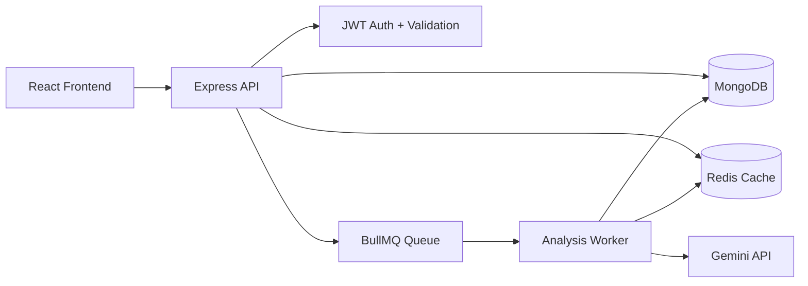

# AI Journal System (MERN + Gemini) — Production-Oriented Edition

AI-powered journaling platform with secure multi-user auth, encrypted journal storage, Redis-backed caching, asynchronous AI analysis jobs, and a scalable backend architecture.

## Project Overview

This repository provides a full-stack MERN application where users can:
- Register/login with JWT auth.
- Create personal journal entries.
- Request AI-powered analysis (emotion, keywords, summary).
- View insights from historical entries.

The backend is reworked for production-readiness with horizontal scaling concerns addressed (caching, queueing, validation, rate limiting, indexing, and clean service boundaries).

## Tech Stack

### Frontend
- React 18
- Vite
- Axios

### Backend
- Node.js (ESM)
- Express
- MongoDB + Mongoose
- Redis (ioredis)
- BullMQ (background processing)
- Gemini (`@google/genai`)
- JWT (`jsonwebtoken`)
- Password hashing (`bcryptjs`)
- Validation (`zod`)
- Security headers (`helmet`)
- Rate limiting (`express-rate-limit`)

## Updated Architecture

```text
backend/
  app.js
  server.js
  config/
    env.js
    db.js
  cache/
    redisClient.js
  controllers/
    authController.js
    journalController.js
  middleware/
    authMiddleware.js
    errorHandler.js
    rateLimiters.js
    validateRequest.js
  models/
    User.js
    JournalEntry.js
  routes/
    authRoutes.js
    journalRoutes.js
  services/
    authService.js
    analysisService.js
    geminiService.js
    journalService.js
  utils/
    encryption.js
    hash.js
    jwt.js
    sanitize.js
  validators/
    authValidators.js
    journalValidators.js
  workers/
    queues.js
    analysisWorker.js
frontend/
  src/
    api/client.js
    components/
      auth/AuthPanel.jsx
      JournalForm.jsx
      EntriesList.jsx
      InsightsPanel.jsx
    App.jsx
    App.css
```

## Architecture Diagram



## System Design & Data Flow

1. User authenticates (`/api/auth/register` or `/api/auth/login`) and receives JWT.
2. Frontend sends JWT in `Authorization: Bearer ...` header.
3. On journal create:
   - Text is hashed (`sha256`) for dedupe/cache lookup.
   - Journal text is encrypted using AES-256-GCM before DB storage.
   - If cached analysis exists in Redis, it is reused immediately.
   - Otherwise a BullMQ job is enqueued for async analysis.
4. Worker consumes jobs, calls Gemini, caches result in Redis, updates entry analysis fields.
5. Insights endpoint aggregates analyzed entries.

## Scalability Strategy (100k+ users)

- **Stateless API nodes**: JWT-based auth allows horizontal scaling behind load balancers.
- **Redis shared cache**: Prevents repeated LLM calls and reduces response latency.
- **BullMQ workers**: Moves heavy AI processing off request thread to background workers.
- **MongoDB indexing**: Optimized for high-frequency read paths (`userId + createdAt`, `textHash`).
- **Rate limiting**: Controls abuse and protects downstream dependencies.
- **Validation + bounded payload sizes**: Prevents malformed/oversized requests.

## LLM Cost Optimization Strategy

- Deterministic text hash (`sha256`) for duplicate detection.
- Redis response cache with configurable TTL.
- Lock-based dedupe key to prevent stampeding concurrent identical AI calls.
- Async queue lets you batch/schedule in future (worker layer ready for delayed processing).

## Caching Strategy

- **Key pattern**: `analysis:<textHash>`
- **Payload**: `{ emotion, keywords, summary }`
- **TTL**: `ANALYSIS_CACHE_TTL_SECONDS` (default 7 days)
- Cache lookup occurs in:
  - direct analyze endpoint
  - journal create flow
  - worker before external LLM call

## Security Measures

- JWT access control for all journal endpoints.
- Password hashing with bcrypt (cost factor 12).
- AES-256-GCM encryption for journal text at rest.
- Prompt sanitization to remove unsafe control chars / delimiters.
- Helmet headers + trust proxy support for HTTPS deployments.
- Route-level and global API rate limiting.
- Zod-based request validation.

## Environment Variables

Create `backend/.env`:

```env
NODE_ENV=development
PORT=5000
CLIENT_ORIGIN=http://localhost:3000

MONGODB_URI=mongodb://127.0.0.1:27017/ai_journal
REDIS_URL=redis://127.0.0.1:6379
GEMINI_API_KEY=your_gemini_key

JWT_SECRET=super_long_random_secret
JWT_EXPIRES_IN=7d

# 64 hex chars = 32 bytes for AES-256 key
ENCRYPTION_KEY=0123456789abcdef0123456789abcdef0123456789abcdef0123456789abcdef

ANALYSIS_CACHE_TTL_SECONDS=604800
DEDUPE_LOCK_TTL_SECONDS=30
```

## Setup & Run Locally

### 1) Install dependencies

```bash
npm run install:all
```

### 2) Start MongoDB and Redis

Use local services or Docker.

### 3) Run app (frontend + backend)

```bash
npm run dev
```

- Frontend: `http://localhost:3000`
- Backend: `http://localhost:5000`

## API Overview

### Auth
- `POST /api/auth/register`
- `POST /api/auth/login`

### Journal (JWT required)
- `POST /api/journal`
- `GET /api/journal`
- `POST /api/journal/analyze`
- `GET /api/journal/insights`

### Health
- `GET /health`

## Deployment Notes

- Deploy API and worker in separate process groups:
  - API pod(s): `node server.js`
  - Worker pod(s): currently bootstrapped from server for simplicity; split into dedicated worker entrypoint for high-volume production.
- Use managed Redis + MongoDB.
- Terminate TLS at ingress/load balancer and set proper `X-Forwarded-*` headers.
- Rotate `JWT_SECRET` and `ENCRYPTION_KEY` via secret manager.
- Add centralized logging, tracing, and metrics in production (OpenTelemetry/Datadog/etc.).

## Future Enhancements

- Dedicated worker runtime entrypoint and autoscaling policy.
- Refresh tokens / session revocation strategy.
- Fine-grained RBAC and audit trails.
- Streaming AI analysis updates via WebSockets.
